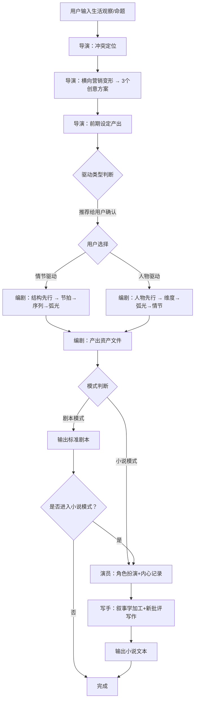

# 产品需求文档 (PRD)

**项目名称**: story-creation 插件 v3.0 重构
**文档状态**: 草稿 (Draft)
**版本号**: 1.0
**创建日期**: 2026-05-26

---

## 1. 执行摘要

重构现有 story-creation 插件，从简单的三 Agent 管道升级为四角色（导演/编剧/演员/写手）故事创作工程化系统。引入叶茂中冲突直觉 + 麦基/菲尔德戏剧理论 + 横向营销变形工具作为创意引擎，支持剧本/小说双输出模式，通过资产化前期设计对冲中期不确定性。

---

## 2. 背景与上下文

### 2.1 问题陈述

- **当前痛点**: 现有 story-creation 插件为简单的 Designer→Writer→Reviewer 管道，缺乏创意生成环节、无角色扮演机制、无叙事学写作层、无模式切换
- **影响范围**: 用户无法从"生活观察"出发进行创作，无法利用 AI 角色扮演探索人物内心，无法产出小说级别的文学文本
- **业务影响**: 插件创作能力上限低，仅能产出基础故事稿本

### 2.2 核心机会

基于 OpenKB 知识库中已入库的 8 本参考书籍（麦基三部曲、电影剧本写作基础、给青年编剧的信3.0、叶茂中三书、文学批评入门），构建一套**理论驱动、流程固化、资产化管理**的故事创作系统。

### 2.3 理论参考体系

| 参考书 | 核心贡献 |
|--------|---------|
| 罗伯特·麦基虚构艺术三部曲 | 故事结构、人物设计、对白设计、情节vs人物关系 |
| 电影剧本写作基础（悉德·菲尔德） | 三幕式结构、段落设计、情节点、戏剧冲突 |
| 给青年编剧的信3.0（宋方金） | 剧作中心制、钩子与阻力、喜剧创作 |
| 叶茂中三书 | 消费者心智冲突洞察、横向营销六工具（变形引擎） |
| 文学批评入门（汤拥华） | 叙事学（视点/焦距/时距）、新批评（细读/张力/悖论/反讽） |

---

## 3. 目标与范围

### 3.1 目标

- **[G1]**: 四角色分工管道可运行：导演→编剧→[演员→写手]，产出标准剧本或小说
- **[G2]**: 导演具备冲突定位 + 横向营销变形能力，输入生活观察/命题，输出故事主题和核心概念
- **[G3]**: 演员使用 DeepSeek 角色扮演提示词，在说对白之间记录角色的"感受"和"心想"
- **[G4]**: 写手基于演员记录 + 叙事学/新批评方法，产出文学性小说文本
- **[G5]**: 统一工作区管理（workspace/{project}/）+ Git 版本控制 + Hook 自动 commit

### 3.2 非目标

- **[NG1]**: 不做纯 AI 自动写作（不含人工交互的端到端生成）
- **[NG2]**: 不做多用户协作/云端同步
- **[NG3]**: 不做出版级排版和格式转换（epub/pdf 导出）
- **[NG4]**: 不使用精神分析批评、女性主义批评等 AI 无法操作的理论方法
- **[NG5]**: 不做插画/配图生成

---

## 4. 用户故事与需求清单

### US-001: 导演-冲突定位与创意变形 [REQ-001] (优先级: P0)

- **故事描述**: 作为一个写作者，我想要输入一段生活观察或创作命题，让导演从中提取核心冲突并变形为故事创意，以便于将模糊的灵感转化为可执行的故事种子。
- **用户价值**: 解决"有想法但不知道怎么写"的核心痛点——从生活到故事的"第一公里"。
- **独立可测性**: 输入任意文本（一句话命题、一段生活观察、或两者混合），导演输出包含以下字段的结构化创意方案。
- **涉及系统**: director-agent, conflict-engine, deformation-engine
- **验收标准**:
  - [ ] **Given** 用户输入任意文本（命题/观察/混合），**When** 导演执行冲突定位，**Then** 输出包含：核心冲突描述、冲突层面定位（麦基五层：内心/个人/社会/环境/命运）、对抗力量递进（相反/矛盾/否定之否定）、故事主题句（价值+原因）
  - [ ] **Given** 冲突定位完成，**When** 导演执行横向营销变形，**Then** 输出至少 3 个变形方案（每个方案使用不同的横向营销工具：替代/反转/组合/夸张/去除/换序），方案已脱离原始生活场景成为故事创意
  - [ ] **Given** 变形方案生成，**When** 导演完成前期设定，**Then** 输出：核心概念设定（世界观/前提假设/故事脊椎）、初步人物设定（四个自我/弧光方向）、关键道具设定、场景设定大纲
  - [ ] **异常处理**: 当用户输入不足以提取冲突时（如仅输入"写个好故事"），导演追问用户至少一个开放性问题（如"你最近观察到什么让你不舒服的事情？"），不做空洞生成
- **边界与极限情况**:
  - 输入极长文本（5000+字生活记录）时，导演应先压缩为关键冲突点再变形
  - 用户输入本身就是完整故事大纲时，导演跳过变形步骤，直接进入冲突定位和前期设定

### US-002: 导演-驱动类型判断与用户确认 [REQ-002] (优先级: P0)

- **故事描述**: 作为写作者，我希望导演基于主题自动判断故事是情节驱动还是人物驱动，并给我确认和修改的机会。
- **用户价值**: 避免在错误的创作路径上浪费精力——情节驱动的故事需要先设计节拍和序列，人物驱动的故事需要先设计弧光和维度。
- **独立可测性**: 导演完成冲突定位后，输出驱动类型推荐及理由，用户可确认或覆盖。
- **涉及系统**: director-agent, story-router
- **验收标准**:
  - [ ] **Given** 导演完成冲突定位和前期设定，**When** 分析故事脊椎，**Then** 输出推荐类型（情节驱动/人物驱动）+ 判断理由（引用麦基标准：外部目标→情节驱动，内部变化→人物驱动）
  - [ ] **Given** 导演输出推荐，**When** 用户确认或手动选择，**Then** 编剧的后续构思路径按所选类型走
  - [ ] **异常处理**: 用户选择跳过此步骤时，默认为情节驱动（大情节经典设计）
- **边界与极限情况**:
  - 边缘案例：故事同时具备强外部目标和深层内部变化（如《绝命毒师》），导演推荐"混合驱动——以情节驱动为主线，人物弧光并行"，由用户选择侧重

### US-003: 编剧-基于导演方案落地故事资产 [REQ-003] (优先级: P0)

- **故事描述**: 作为写作者，我想要编剧将导演的创意方案落地为具体的故事资产（人物关系、冲突结构、情节设计、对白、场景脚本），以便于后续的演员扮演和写手加工。
- **用户价值**: 将导演的"方向性创意"转化为可执行的故事资产——每个资产可独立追踪、独立修改、独立使用。
- **独立可测性**: 导演方案输入后，编剧产出独立资产文件，每个资产有独立格式。
- **涉及系统**: screenwriter-agent, asset-generator
- **验收标准**:
  - [ ] **Given** 导演方案（含驱动类型），**When** 编剧执行落地设计，**Then** 产出以下独立资产文件：
    - 人物设定卡（CharacterProfile[]）：四个自我、定义性维度、弧光类型（六选一）、内在动机（12选2-3）、人物关系图
    - 场景设定卡（SceneSetting[]）：每场戏的地点/时间/参与人物/开篇价值/结尾价值/节拍序列
    - 道具设定卡（PropSetting[]）：关键道具的象征意义、与人物/场景的关联
    - 场景脚本（SceneScript[]）：完整对白 + 舞台指示 + 节拍标记
  - [ ] **Given** 情节驱动路径，**When** 编剧设计，**Then** 先构建情节弧光和节拍，再推导人物弧光（结构先行）
  - [ ] **Given** 人物驱动路径，**When** 编剧设计，**Then** 先设计人物维度和弧光，再推导情节事件（人物先行）
  - [ ] **异常处理**: 场景价值无转折时（开场价值=结尾价值），标记为"解说性场景"并给出改写建议
- **边界与极限情况**:
  - 长篇故事（100+场景）时分批产出，每批 10-15 个场景，保持一致性
  - 人物关系图需标明冲突轴（谁和谁在什么层面冲突）

### US-004: 剧本模式输出 [REQ-004] (优先级: P0)

- **故事描述**: 作为写作者，我想要在编剧完成后直接获得标准剧本格式的输出（场景+对白+舞台指示），以便于直接用于拍摄或进一步修改。
- **用户价值**: 剧本模式是最小可行路径——快速从创意到可用剧本。
- **独立可测性**: 编剧完成所有场景脚本后，合并输出为标准剧本格式文件。
- **涉及系统**: screenwriter-agent, script-formatter
- **验收标准**:
  - [ ] **Given** 编剧完成所有场景脚本，**When** 触发剧本输出，**Then** 产出标准剧本格式文件（场景号/地点/时间/人物/舞台指示/对白），符合行业基本格式
  - [ ] **Given** 剧本输出完成，**When** 用户查看，**Then** 包含完整的故事信息（不依赖外部文件即可阅读）
  - [ ] **异常处理**: 场景编号不连续或缺失时，自动检测并提示用户
- **边界与极限情况**:
  - 对白密度过高场景（单场景对白超过 2000 字），提示"建议加入视觉动作打断"

### US-005: 演员-R1角色扮演与内心记录 [REQ-005] (优先级: P0 小说模式)

- **故事描述**: 作为写作者，我想要 AI 以角色身份按编剧的定稿对白"演一遍"，在说对白之间自然记录下角色的"感受"和"心想"，以便于后续写手在写作时能进入人物的内心世界。
- **用户价值**: 获得每个角色在每场戏中的内部独白——这是从剧本到小说的关键原料，解决了"知道了人物做了什么，但不知道人物在想什么"的核心问题。
- **独立可测性**: 输入编剧的 SceneScript[] + CharacterProfile[]，演员（Agent Teams，每角色一个 Agent）按场次依次扮演，产出 ActorRecord[]。
- **涉及系统**: actor-agent, agent-teams-orchestrator, deepseek-roleplay-engine
- **验收标准**:
  - [ ] **Given** 编剧的场景脚本和人物设定，**When** 演员 Agent 以角色身份扮演，**Then** 正确说出对白，并**在对白之间**记录：角色此刻的身体感受、内心未说出口的话（"心想"）、对对方台词的真实反应
  - [ ] **Given** 使用 DeepSeek V4 角色扮演提示词（`【角色沉浸要求】` + `<think>` 标签内第一人称内心独白），**When** 演员扮演，**Then** 每个角色的思考过程以角色第一人称呈现（如"（心想：……）"），不跳出角色
  - [ ] **Given** 多角色场景，**When** Agent Teams 编排，**Then** 按场景节拍顺序依次对话，每个角色在"说"之前/之后记录内部状态
  - [ ] **异常处理**: 角色 OOC（脱离角色设定）时，记录该处并标记为"扮演异常"，不中断整个场景
- **边界与极限情况**:
  - 单角色独白场景：演员仍需记录独白前的身体状态和独白过程中的内部感受变化
  - 多角色场景（5+角色）：按节拍分组，每组2-3角色交替对话
- **记录格式**：
  ```
  场景ID: S003
  节拍: 3
  角色: 端白
  对白: "我不知道这一切意味着什么。"
  身体感受: 喉咙发紧，手指在袖口里蜷起来
  心想（未说出的话）: 我才十四岁。他们为什么都看着我？我讨厌这种被注视的感觉。
  情绪变化: 困惑 → 轻微的愤怒
  ```

### US-006: 写手-叙事学加工与小说输出 [REQ-006] (优先级: P0 小说模式)

- **故事描述**: 作为写作者，我想要写手基于演员的内心记录，运用叙事学和新批评方法，将剧本转化为文学性小说文本。
- **用户价值**: 解决了"有了剧本但写不成小说"的核心问题——写手拥有叙事学工具（视点/焦距/时距）和新批评工具（细读/张力/悖论/反讽），产出有文学质感的小说。
- **独立可测性**: 输入 ActorRecord[] + SceneScript[] + CharacterProfile[] + 导演叙事定位方案，写手产出完整小说文本。
- **涉及系统**: writer-agent, narratology-engine, new-criticism-engine
- **验收标准**:
  - [ ] **Given** 演员记录、场景脚本、人物设定、导演叙事定位方案，**When** 写手加工写作，**Then** 产出的文本满足：
    - 叙事视点一致（按导演确定的视点/人称/可靠度）
    - 焦距变化有意图（推近/拉远服务于叙事节奏）
    - 时距分配合理（省略/概述/场景/拉伸/停顿五类有意识使用）
    - 人物内心世界基于演员记录（不凭空编造人物感受）
  - [ ] **Given** 新批评方法指导，**When** 写手处理文字层面，**Then** 产出文本体现：细读级别的语言质感、有意识的张力结构、悖论和反讽的恰当使用
  - [ ] **Given** 写手完成初稿，**When** 质量检查，**Then** 通过编辑审查（抄袭检查 + 技术审核 + 讲述者行为一致性检查）
  - [ ] **异常处理**: 演员记录数据缺失某角色的某场景时，写手使用编剧的场景脚本进行补充描写（仅写外部动作，不编造内心）
- **边界与极限情况**:
  - 叙事学方法采用汤拥华《文学批评入门》中 AI 可直接操作的部分：视点（内/外/零聚焦）、焦距（微距/中距/远距）、时距（省略/概述/场景/拉伸/停顿）
  - 新批评方法采用 AI 可直接操作的部分：张力（词语的含混与多义）、悖论（表面的矛盾指向深层真理）、反讽（说A意指B）、细读（逐句的语言质感审视）
  - **排除**: 精神分析批评、女性主义批评（AI 不可操作的纯理论）

### US-007: 模式切换 [REQ-007] (优先级: P1)

- **故事描述**: 作为写作者，我想要在项目开始时选择模式，也想要在剧本完成后随时切换到小说模式继续创作。
- **用户价值**: 灵活的创作路径——可以先快速出剧本，满意后再深加工为小说。
- **独立可测性**: 项目创建时可选择模式；剧本模式下编剧完成后询问是否进入小说模式；用户随时输入"切换小说模式"可从中断点继续。
- **涉及系统**: orchestrator, mode-switcher
- **验收标准**:
  - [ ] **Given** 创建新项目，**When** 系统启动，**Then** 询问模式选择（剧本/小说），记录在项目配置中
  - [ ] **Given** 剧本模式下的编剧完成，**When** 场景脚本输出完成，**Then** 询问用户"是否继续进入小说模式（演员扮演+写手加工）？"
  - [ ] **Given** 用户在剧本模式下说"切换到小说模式"，**When** 当前编剧阶段已完成，**Then** 从演员环节开始继续流程
  - [ ] **异常处理**: 编剧未完成时请求切换，提示"建议编剧完成后再切换，否则演员缺少完整对白和场景脚本"
- **边界与极限情况**:
  - 小说模式下不可反向切换回纯剧本模式（已在演员环节产生资产）

### US-008: 工作区与版本管理 [REQ-008] (优先级: P1)

- **故事描述**: 作为写作者，我想要所有项目统一在一个工作区目录下，每个项目独立文件夹，使用 Git 进行版本管理。
- **用户价值**: 项目隔离、历史可追溯、多项目并行管理。
- **独立可测性**: 创建项目自动初始化工作区结构；每个阶段产出保存后自动 commit（Hook 触发）。
- **涉及系统**: workspace-manager, git-hook-automation
- **验收标准**:
  - [ ] **Given** 创建新项目，**When** 系统初始化，**Then** 在 `workspace/{project-name}/` 下创建 `design/` `assets/` `drafts/` 子目录，并 `git init`
  - [ ] **Given** 任一阶段产出保存到工作区，**When** 文件写入完成，**Then** PostToolUse Hook 自动执行 `git add <file> && git commit -m "<stage>: <summary>"`
  - [ ] **Given** 用户查看工作区，**When** 列出 `workspace/`，**Then** 所有项目以独立文件夹呈现，`git log` 可见完整修改历史
  - [ ] **异常处理**: Git 未安装时降级为手动保存模式，不阻塞创作流程
- **边界与极限情况**:
  - 项目名称冲突时自动添加序号后缀（如 `my-story-2`）
  - Commit message 格式：`[导演] 冲突定位与主题设定` / `[编剧] 人物设定卡完成` / `[演员] S003 场景扮演记录` / `[写手] 第一章初稿`

---

## 5. 用户体验与设计

### 5.1 关键用户旅程



### 5.2 交互规范

- 导演阶段：分析完成后展示创意方案，用户选择或提出修改方向
- 编剧阶段：后台运行，产出资产文件后通知用户
- 演员阶段：展示每个场景的扮演进度，用户可见角色内心记录
- 写手阶段：输出可预览的章节文本，用户可逐章确认

---

## 6. 约束与限制

### 6.1 技术约束

- **运行环境**: Claude Code 插件系统，依赖 Agent 工具调度
- **模型依赖**: DeepSeek V4（演员角色扮演，利用 `<think>` 标签内建机制）
- **文件系统**: 本地文件操作，Git 命令行工具可用
- **性能预期**: 单场景演员扮演 < 60s，单个故事完整流程 < 15 min（含 LLM 调用时间）

### 6.2 理论约束

- 导演创意方法论：叶茂中冲突直觉 + 麦基五层冲突 + 横向营销六工具变形
- 编剧方法论：麦基三部曲 + 悉德·菲尔德三幕式 + 宋方金钩子与阻力
- 演员方法论：DeepSeek V4 角色扮演提示词 + Agent Teams 编排
- 写手方法论：汤拥华叙事学 + 新批评可操作部分

### 6.3 排除的理论方法

- 精神分析批评（弗洛伊德/拉康理论，AI 无法操作）
- 女性主义批评（依赖社会历史语境判断，AI 无法操作）
- 文化批评/后殖民批评（依赖外部知识体系，AI 无法操作）

---

## 7. 成功指标

| 核心指标 | 目标值 | 测量方式 |
|----------|--------|---------|
| 管道完整运行 | 100% 场景可完成导演→编剧→[演员→写手]全流程 | 端到端测试 |
| 演员内心记录覆盖率 | 每个角色/每场戏均有 ActorRecord | 资产文件完整性检查 |
| 资产化产出 | 每个项目产出 ≥ 5 个独立资产文件 | 工作区文件计数 |
| Git 自动 commit | 每个阶段保存后 100% 触发 commit | Hook 日志 |

---

## 8. 完成标准

- [ ] 所有的验收标准 (AC) 全部测试通过
- [ ] 导演/编剧/演员/写手四个 Agent 可独立调用
- [ ] 剧本模式和小说模式完整流程可走通
- [ ] 工作区自动初始化和 Git Hook 正常运行
- [ ] 模式切换逻辑覆盖所有路径（3条）
- [ ] 演员记录格式符合规格（场景ID/角色/对白/身体感受/心想/情绪变化）
- [ ] 写手产出通过编辑审核（抄袭检查 + 技术审核 + 行为一致性）

---

## 9. 附录

### 9.1 术语表

| 术语 | 定义 |
|------|------|
| 冲突定位 | 导演核心方法：从用户输入中提取核心冲突张力，定位冲突层面，确定对抗力量递进，提炼故事主题 |
| 横向营销变形 | 使用替代/反转/组合/夸张/去除/换序六种工具对生活观察进行创意变形 |
| 资产化 | 将故事设计产出分解为独立、可追踪、可修改的资产文件 |
| ActorRecord | 演员扮演后的内心独白记录（场景ID/角色/对白/身体感受/心想/情绪变化） |
| Agent Teams | 多角色场景中，每个角色一个 Agent，按节拍顺序依次对话的编排机制 |
| 情节驱动 vs 人物驱动 | 故事脊椎的分岔：外部目标驱动走情节先行，内部变化驱动走人物先行 |
| DeepSeek 角色扮演提示词 | `【角色沉浸要求】` 指令 + `<think>` 标签内第一人称内心独白 |

### 9.2 参考资料

- 罗伯特·麦基虚构艺术三部曲 (OpenKB)
- 电影剧本写作基础 (OpenKB)
- 给青年编剧的信3.0 (OpenKB)
- 叶茂中三书：广告人手记/叶茂中的营销策划/迅速提升品牌与销量的叶茂中经验 (OpenKB)
- 文学批评入门 (OpenKB)
- 提示词迭代/V10（用户前期探索）
