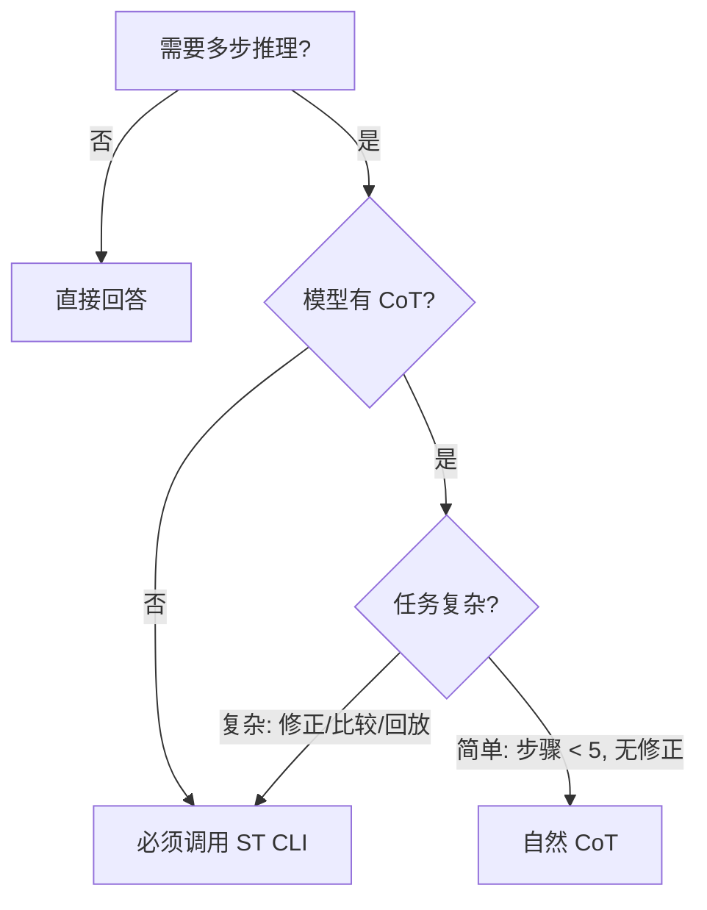

# Sequential Thinking

这个 skill 的核心不是“多写几段 thought”，而是让 AI 在复杂问题里**持续推进、允许修正，并最终收敛成结论**。CLI 只是执行载体；skill 本身负责定义什么时候该进入这种思考方式，以及如何避免把顺序思考退化成松散输出。

## Mission

这个 skill 用来把复杂问题处理成一个**有边界、可修正、可复核的推理过程**：

- 先澄清问题，而不是急着给答案
- 在推进过程中允许修正和调整判断
- 在复杂度上升时比较替代路径，而不是单线硬推
- 在有限步数内收敛成结论与建议
- 最后保留可回放的推理轨迹

它解决的不是“不会想”，而是“想得太散、太早下结论、太难复核”。

## Core Capabilities

- **迭代推进**: 把复杂问题拆成连续步骤，而不是试图一口气得到完整答案
- **动态修正**: 当新证据出现时，允许回看并修正前面的判断
- **分支比较**: 当存在替代路径时，允许先比较再收敛
- **上下文保持**: 在多步推理中维持清晰的问题边界与目标
- **结论收束**: 最终必须形成判断，而不是无限发散

## When to Use

### 核心判断规则

> **模型能力决定基线，任务复杂度决定是否升级。**

| 模型能力 | 简单任务 | 复杂任务 |
|---------|:-------:|:-------:|
| **有思维链（CoT）** | 自然 CoT 即可 | 调用 ST CLI |
| **无思维链** | **必须调用 ST CLI** | **必须调用 ST CLI** |

### 判断口诀

> **"无 CoT → 必须用 ST**
> **有 CoT → 复杂才用 ST"**

### 必须调用 CLI 的场景

| 场景 | 判断标准 | 为什么需要 CLI |
|------|---------|---------------|
| **无 CoT 模型** | 当前模型不支持思维链输出 | 必须依赖外部工具组织推理 |
| **修正前提** | 推理过程中发现前面判断错了，需要回头修正 | CLI 会话保留历史，支持回看修正 |
| **多方案比较** | 需要在 2+ 个候选方案之间做权衡决策 | `branch` 模式专为分支比较设计 |
| **可回放轨迹** | 需要留下可审计、可复现的推理过程 | CLI 支持生成 replay 文档 |
| **复杂收敛** | 问题需要 > 5 步才能收敛到结论 | 强制步数限制防止无限发散 |

### 有 CoT 时可直接用自然 CoT 的场景

| 场景 | 判断标准 | 为什么不需要 CLI |
|------|---------|-----------------|
| **单向推理** | 不需要回头修正，线性推进 | 模型自然输出即可 |
| **简单分析** | 问题边界清晰、步骤 < 5 | 不需要复杂工具辅助 |
| **快速决策** | 只需结论，不需要可回放轨迹 | CoT 足够表达推理 |
| **探索性思考** | 还在发散阶段，不确定是否需要收敛 | 先用 CoT 探索，再决定是否用 CLI |

### 决策树



### 不适用场景

- 简单事实查询
- 单步即可完成的任务
- 路径已经非常明确、无需多步推演的问题
- 纯头脑风暴且暂时不要求收敛的场景

## Working Philosophy

- **先找主问题，再找答案**：不要把现象描述误当作根因定位
- **允许修正，而不是硬撑前提**：前面想错了，就回头修，不要带着错误前提继续推进
- **先消除复杂度，再堆解决方案**：优先识别主矛盾，而不是抢着给补丁
- **每一步只推进一步**：当前步只表达当前判断，不重复整套背景
- **最终必须落到结论**：不能把“我还能继续想”当作默认出口

## Installation & Runtime Model

这个 skill 面向 agent 交付思考方式与调用约束；CLI 通过 npm 分发。

在使用前，应先确保本地已安装对应 CLI：

```bash
npm install -g sequential-thinking-cli

# 或
pnpm add -g sequential-thinking-cli
```

安装后，使用 `sthink` 作为命令入口。

## CLI Contract

本 skill 不再要求 AI 手写 thought JSON。执行层通过 CLI 主路径动作完成：

- `start`
- `step`
- `replay`

### `start`

只接受四个输入：

- `name`
- `goal`
- `mode`
- `totalSteps`

约束：

- `mode` 仅允许 `explore`、`branch`、`audit`
- `totalSteps` 仅允许 `5` 或 `8`

如果你不确定该选哪种模式，默认用 `explore`。只有在任务明显是在比较候选路径时才用 `branch`；只有在任务明显是在审查既有判断时才用 `audit`。

### `step`

只接受：

- `content`

其余上下文应由 runtime 自动恢复并注入。

### `replay`

用于读取已完成会话并生成 replay 文档；如需要，可额外导出到当前目录。

## Recommended Workflow

```text
1. 先判断问题是否真的需要 sequential-thinking，而不是默认套用。
2. 如需要，先安装或确认本地已有 npm CLI。
3. 用 `sthink start` 给出 `name`、`goal`、`mode`、`totalSteps`。
4. 用 `sthink step` 逐步推进，每一步只写当前推进内容。
5. 当出现新证据时，允许修正，而不是硬撑旧判断。
6. 到收敛阶段时，必须输出结论、风险与下一步建议。
7. 完成后按需使用 `sthink replay` 生成与导出回放文档。
```

## Examples

以下示例不是为了让你回去手写 JSON，而是为了说明这种 skill 真正有价值的地方：**如何推进、如何修正、如何收敛**。

### Example 1: 基础推演

```bash
sthink start --name "query-diagnosis" --goal "定位查询性能下降的主因" --mode explore --totalSteps 5
sthink step --sessionPath "<session-path>" --content "先不要急着选优化手段。需要先把问题拆成几层：是单条 SQL 退化、接口级 N+1，还是更上层的调用放大。若根因没分清，后面的缓存、索引、重写都可能只是补丁。"
sthink step --sessionPath "<session-path>" --content "从查询日志看，用户详情接口在一次请求里触发了大量重复读取，已经出现明显的 N+1 信号。但还不能直接下结论，因为重复查询也可能只是症状；需要继续确认慢点究竟来自“查询次数过多”，还是“某条关键查询本身很慢”。因此总步数上调一档。"
sthink step --sessionPath "<session-path>" --content "结论可以收敛了：主因是列表页批量加载时触发的 N+1，次因是关联字段缺少索引放大了单次查询成本。优化顺序应该先消除 N+1，再补索引验证尾延迟；这样既先打掉主矛盾，也避免一上来引入缓存复杂度。"
```

### Example 2: 修正前提

```bash
sthink step --sessionPath "<session-path>" --content "回看 profiling 结果后，前面的判断需要修正：真正拖垮接口的不是 N+1 本身，而是关联列缺少索引，导致每次关联查询都在放大全表扫描成本。也就是说，N+1 仍然存在，但它不是第一性瓶颈，优先级应该后移。"
```

### Example 3: 复杂变更拆解

```bash
sthink start --name "change-impact-analysis" --goal "拆解复杂变更的影响与优先级" --mode explore --totalSteps 5
sthink step --sessionPath "<session-path>" --content "用户一次性提出了多项规则修改，不该把它们当成同一种改动处理。先拆开看：有的是机制原则调整，有的是数值平衡，有的是接口语义变化，还有的是文档与实现脱节。如果不先分型，后面会把“该改 ADR 的”“该改设计文档的”“该补代码契约的”混成一锅。"
sthink step --sessionPath "<session-path>" --content "先做影响矩阵。机制原则类改动通常会回流到 ADR 和 System Design；数值平衡会影响规则表、配置与测试基线；接口语义变化最危险，因为它会悄悄破坏调用方的假设。这里最该警惕的不是改动数量，而是有没有改到“被多个模块默认依赖、但文档里没写清楚”的隐性契约。"
sthink step --sessionPath "<session-path>" --content "可以收敛了：先处理那些会改变系统边界或调用语义的项，再处理数值与体验层面的项。顺序上应优先修正文档与契约，再讨论平衡性；否则后续所有实现和评审都会建立在漂移的前提上。结论不是“先改最显眼的”，而是“先修最容易污染系统认知的”。"
```

### Example 4: 分支比较

```bash
sthink start --name "performance-tradeoff" --goal "比较缓存止血与查询优化的优先级" --mode branch --totalSteps 5
sthink step --sessionPath "<session-path>" --content "方案 A：先引入缓存削峰。好处是见效快、对接口层侵入小，适合先止血；坏处是会把问题从“数据库慢”转成“缓存一致性与失效策略复杂”，如果根因其实是查询设计不合理，这条路容易把偶然复杂度永久留在系统里。与此同时，方案 B：直接做索引优化和查询重写。好处是从根上消除瓶颈，长期结构更干净；代价是需要更仔细验证写入放大、锁竞争和回归风险。这条路更慢，但如果业务模型稳定，通常比提前上缓存更符合简单优先的原则。"
```

## Storage & Export Boundary

- runtime 会自动保存会话状态与步骤记录
- 完成态可生成 replay 文档
- `replay` 支持导出到当前目录，便于审阅与复用

## Heuristic Reminders

以下提醒是启发式问题，不是硬约束。真正重要的是：它们能帮助你减少空转，逼近结论。

- **问题定义提醒**: 你现在是在描述现象，还是在定位根因？
- **证据提醒**: 当前判断基于事实、观察结果，还是基于猜测与假设？
- **边界提醒**: 当前问题影响的是局部模块、单系统，还是跨系统结构？
- **复杂度提醒**: 你是在消除本质复杂度，还是在增加偶然复杂度？
- **收敛提醒**: 当前是否已经足够形成结论，还是仍在无效发散？

## Tips

- 不要再手写 thought JSON；让 CLI runtime 负责节奏、落盘与 replay
- 不要把 sequential-thinking 当成默认模式，只在真正需要多步收敛时调用
- 如果不确定模式，先用 `explore`
- `step` 的 `content` 只表达当前推进内容，不要重复补全系统上下文
- 如果发现前提错了，就明确修正，不要硬撑
- 到收敛阶段时，应明确输出结论、风险和下一步动作
- 只有已完成会话才能执行 `replay`

